# DashBite — living plan

## Base — Pipeline diagram

```mermaid
flowchart LR
    S[Simulator process<br/>food-delivery orders] -->|write CSV files| RAW[data/raw/<br/>order_id, timestamp, distance_km,<br/>prep_minutes, order_value, was_late]
    RAW -->|read files| P[Preprocess process]
    P -->|write features and labels| READY[data/processed/]
    READY -->|read files| T[Train process]
    T -->|write versioned checkpoint| MODELS[data/models/<br/>model-vN checkpoint]
    MODELS -->|newest checkpoint on disk| I[Inference process]
    READY -->|read features| I
    I -->|write predictions and run outputs| OUT[data/outputs/]
    OUT -->|read existing outputs| D[Model Pulse dashboard]
    OUT -->|sample counts by timestamp| V[Sample-volume time series]
    V --> D

    T -. training may be down .-> I
    MODELS -. existing checkpoint remains available .-> I
```



## Teaching beats

- Each stage is a separate, replaceable process; stages communicate through folders under `data/`, not imports.
- The Makefile is how we orchestrate the demo and smoke tests: use targets such as `make simulator`, `make preprocess`, `make train`, `make infer`, and `make dashboard`.
- Training publishes versioned checkpoints; inference consumes the newest checkpoint already on disk, so inference keeps working when training is unavailable.
- Model Pulse observes existing predictions and outputs. It is a dashboard, not another owner of pipeline logic.
- Use claim-first charts: active titles, human-readable labels, and one clear story per chart rather than a metrics dump.
- Model Pulse must show sample volume over time, not only a single total-volume number.
- Keep the demo intentionally lightweight: plain Python and files, with no containers, Kafka, or Spark.

## Manual Smoke Tests

The Makefile is the public interface for the demo. Once the corresponding targets exist, smoke tests should use commands such as:

```text
make install
make test
make simulator
make preprocess
make train
make infer
make dashboard
make run
make stop
make clean-data
```

## Stage 1 — Configuration and data-directory foundation

### Goal

Establish the smallest reusable foundation for local development and later pipeline stages: environment-driven configuration, predictable data paths, and a test layout that can distinguish unit, regression, and integration coverage.

### Proposed changes

- Add a typed configuration interface, such as `pipeline/config.py`, with defaults including `TRAIN_EVERY_N_EVENTS=2000` and `BATCH_SIZE=50`; environment variables override those defaults.
- Add path helpers, such as `pipeline/paths.py`, that resolve `data/raw`, `data/features`, `data/models`, `data/predictions`, and `data/quality`, and expose an `ensure_data_dirs()` helper to create them.
- Add the minimal package and dependency/project wiring needed to import the configuration and path helpers consistently from later stages.
- Add a Makefile interface for installation, tests, and a short foundation smoke command so classroom commands remain orchestration through `make`.
- Add a pytest layout with `tests/unit/`, `tests/regression/`, and `tests/integration/`, plus marker registration for `unit`, `regression`, and `integration`.

### Architecture / boundaries

- Configuration and path helpers are shared infrastructure only; they must not import simulator, preprocessing, training, inference, or dashboard implementation.
- All paths are rooted under the project `data/` directory and are created explicitly by `ensure_data_dirs()`; no stage creates another stage's outputs implicitly.
- Defaults are deterministic and documented, while environment overrides are read at configuration load time.
- Stages remain separate processes communicating through files and Makefile targets, not by importing one another.
- Keep the foundation plain Python and filesystem-based; do not add containers, Kafka, Spark, or a service dependency.

### Automated tests

- Unit: verify default configuration values, environment overrides, project-root-relative path resolution, and idempotent directory creation.
- Regression: lock the public configuration field names, default values (`TRAIN_EVERY_N_EVENTS=2000`, `BATCH_SIZE=50`), and expected data-directory names.
- Integration: load configuration and create all data directories in a temporary project/data root, then assert the complete directory set exists and is reusable.
- Run the automated gate through the Makefile (for example, `make test`) with pytest markers available for selecting `-m unit`, `-m regression`, or `-m integration`.

### Manual Smoke Test

#### What we're proving

The public configuration loader honors an environment override, and the path helper resolves and creates every required data directory.

#### Terminal

First verify configuration and directory creation through the Makefile:

```sh
TRAIN_EVERY_N_EVENTS=10 make smoke-foundation
```

The target should print `load_config()` and the paths returned by `ensure_data_dirs()`. The output should visibly show `TRAIN_EVERY_N_EVENTS=10`, `BATCH_SIZE=50`, and the `data/raw`, `data/features`, `data/models`, `data/predictions`, and `data/quality` directories. Confirm those directories exist on disk.

Then start the intake process with a small, fast batch for the live demo:

```sh
BATCH_SIZE=3 POLL_INTERVAL_SECONDS=1 make simulator
```

In a second terminal, inspect the file while the simulator runs:

```sh
head -n 5 data/raw/orders.csv
```

#### Watch for

- The override is visible in the printed configuration while `BATCH_SIZE` remains at its default.
- Every required directory is printed and exists beneath the repository's `data/` folder.
- The simulator logs each written batch, and `data/raw/orders.csv` has the six expected fields: `order_id`, `timestamp`, `distance_km`, `prep_minutes`, `order_value`, and `was_late`.
- Re-running `make smoke-foundation` succeeds without errors or duplicate-directory failures.

#### Stop

Press `Ctrl+C` in the simulator terminal. It should log that the simulator stopped.

## Stage 2 — Raw-order preprocessing

### Goal

Turn raw intake CSV rows into clean, model-ready feature rows while preserving the late-order label and keeping preprocessing as an independent file-based stage.

### Proposed changes

- Add `pipeline.preprocess`, runnable as `python -m pipeline.preprocess`, to read raw orders from `data/raw/`.
- Validate and discard invalid rows, including missing fields, malformed timestamps, non-numeric values, out-of-range measurements, and invalid `was_late` labels; log counts for accepted and rejected rows.
- Derive `hour` from `timestamp` and `is_peak` from the agreed peak-hour rule, while retaining `order_id`, source fields, and `was_late`.
- Write a readable feature CSV under `data/features/` (for example, `features.csv`) with a stable header and no writes to model, prediction, or quality outputs.
- Add or update the `make preprocess` target and add focused tests for cleaning, feature derivation, schema stability, and one-tick file processing.

### Architecture / boundaries

- Preprocessing reads only files under `data/raw/` and writes only under `data/features/`; it must not import or invoke simulator, training, inference, or dashboard stages.
- Stages communicate through CSV files and Makefile targets, not in-memory calls or cross-stage imports.
- The `was_late` label remains available for downstream training and is not transformed into a prediction.
- Processing should be safe to repeat: rerunning against the same raw input produces deterministic feature values without accumulating duplicate output rows.
- Keep the implementation plain Python and filesystem-based, with visible logs suitable for a classroom demonstration.

### Automated tests

- Unit: verify invalid-row filtering, timestamp parsing, hour extraction, peak-hour classification, numeric conversion, and preservation of `was_late`.
- Regression: lock the feature CSV column order and required names, including `hour`, `is_peak`, and `was_late`; verify malformed rows never appear in output.
- Integration: write a seeded raw fixture under a temporary `data/raw/`, run one preprocessing tick, and assert the expected feature CSV is created under `data/features/` with the golden cleaned rows.
- Run all checks through `make test`; use the existing `unit`, `regression`, and `integration` pytest markers.

### Manual Smoke Test

#### What we're proving

The independent file handoff works visibly: the simulator writes raw orders, preprocessing reads `data/raw/`, cleans and enriches them, and writes a feature CSV under `data/features/` containing `hour`, `is_peak`, and `was_late`.

#### Terminal

Terminal 1 — start intake:

```sh
BATCH_SIZE=3 POLL_INTERVAL_SECONDS=1 make simulator
```

Terminal 2 — run preprocessing:

```sh
make preprocess
```

Terminal 3 — inspect the handoff while both loops run:

```sh
ls -l data/raw data/features
head -n 5 data/raw/orders.csv
head -n 5 data/features/features.csv
```

#### Watch for

- Terminal 1 logs batches written to `data/raw/orders.csv`.
- Terminal 2 logs rows read, rejected, and written to `data/features/features.csv`.
- The feature header and rows visibly include `hour`, `is_peak`, and `was_late`.
- No files appear under `data/models/` or `data/predictions/` as a result of preprocessing.

#### Stop

Press `Ctrl+C` in Terminals 1 and 2 to stop the simulator and preprocessing loops.

## Stage 3 — Model training and checkpoint publication

### Goal

Train a small, reproducible late-order classifier from clean features and make the model's durable write path visible: a versioned checkpoint and metrics sidecar published under `data/models/`.

### Proposed changes

- Add `pipeline.train`, runnable as `python -m pipeline.train`, to read the feature CSV from `data/features/`.
- Train `sklearn.linear_model.LogisticRegression` using exactly `distance_km` and `prep_minutes` as model inputs, with `was_late` as the label.
- Use `TRAIN_EVERY_N_EVENTS` as the minimum sample threshold before publishing; log a clear message and publish nothing when insufficient labeled rows are available.
- Publish a versioned joblib checkpoint under `data/models/` (for example, `model-v001.joblib`) and a matching small metrics sidecar (for example, `model-v001.metrics.json`) containing version, sample count, feature names, and basic evaluation metrics.
- Add a `make train` target and retain training as a one-shot publisher; it must not import, call, wait on, or otherwise depend on inference.
- Add focused tests for feature selection, threshold behavior, version increments, checkpoint/sidecar contents, and repeatable publication.

### Architecture / boundaries

- Training reads only `data/features/` and writes only versioned artifacts under `data/models/`; it must not write predictions or quality outputs.
- The training process publishes artifacts to disk and exits; inference is a separate consumer in a later stage.
- The model interface is the persisted checkpoint plus metrics sidecar, not Python imports between runtime stages.
- `TRAIN_EVERY_N_EVENTS` is configuration, not a hard-coded training constant; environment overrides must work through the existing shared config.
- Keep the implementation plain Python/filesystem-based and avoid introducing orchestration or service dependencies.

### Automated tests

- Unit: verify the trainer selects only `distance_km` and `prep_minutes`, uses `was_late`, honors the configured threshold, and produces metrics metadata.
- Regression: lock checkpoint and sidecar naming/version conventions, required sidecar fields, and the LogisticRegression feature list.
- Integration: write a deterministic labeled feature fixture, run one training command, and assert a versioned joblib checkpoint plus matching metrics sidecar appear under `data/models/`; run again and verify the next version is published without overwriting the first.
- Run all checks through `make test` with the existing unit, regression, and integration markers.

### Manual Smoke Test

#### What we're proving

Training published a model artifact to disk without involving inference.

#### Terminal

Drive the data through Makefile targets, then train with a small threshold:

```sh
make clean-data
BATCH_SIZE=10 POLL_INTERVAL_SECONDS=1 make simulator
```

In a second terminal, preprocess the incoming raw orders:

```sh
make preprocess
```

After at least one feature batch is visible, stop both long-running processes with `Ctrl+C`, then publish the model:

```sh
TRAIN_EVERY_N_EVENTS=10 make train
ls -lh data/models
cat data/models/model-v001.metrics.json
```

#### Watch for

- `make train` logs that a versioned model and metrics sidecar were published.
- `data/models` contains both `model-v001.joblib` and `model-v001.metrics.json` (or the next version if artifacts already exist).
- The metrics sidecar is readable JSON and names `distance_km` and `prep_minutes`.
- No inference process or prediction output is involved.

#### Stop

Press `Ctrl+C` in the simulator and preprocessing terminals before running `make train`.

## Stage 4 — Artifact-based inference

### Goal

Consume the newest published model checkpoint and score feature rows independently, proving that inference continues to work from a model already on disk even when training is stopped.

### Proposed changes

- Add `pipeline.infer`, runnable as `python -m pipeline.infer`, to discover the newest complete checkpoint under `data/models/`.
- Read model-ready rows from `data/features/features.csv`, use the checkpoint's `distance_km` and `prep_minutes` interface, and write predictions under `data/predictions/`.
- Emit a stable prediction CSV containing `order_id`, `late_probability`, `predicted_late`, and `checkpoint_id`.
- Use the checkpoint's probability output and a documented decision threshold to produce `predicted_late`; record the checkpoint identifier from the artifact filename/version.
- Add a `make infer` target. Inference must wait cleanly and log a readable message when no complete checkpoint exists, then retry without failing.
- Add focused tests for newest-checkpoint selection, prediction schema and values, checkpoint provenance, missing-checkpoint waiting, and repeatable scoring.

### Architecture / boundaries

- Inference reads only files under `data/models/` and `data/features/` and writes only under `data/predictions/`; it must never import, call, or trigger `pipeline.train`.
- The persisted checkpoint is the runtime interface between training and inference; no shared in-memory model object or stage-to-stage runtime import is allowed.
- Select only complete checkpoint/metrics pairs and ignore partial or malformed publications.
- If training is stopped, inference continues using the newest valid checkpoint already on disk; a missing checkpoint is a normal waiting state, not a crash loop.
- Keep the implementation plain Python and filesystem-based with visible logs for classroom demonstration.

### Automated tests

- Unit: verify newest complete checkpoint discovery, feature-column selection, probability-to-label conversion, prediction schema, and clean waiting behavior with no checkpoint.
- Regression: lock the prediction column order (`order_id`, `late_probability`, `predicted_late`, `checkpoint_id`) and checkpoint identifier format.
- Integration: publish a deterministic checkpoint fixture, run one inference tick, and assert readable predictions under `data/predictions/`; add another feature batch after training is stopped and verify inference still scores it from the existing checkpoint.
- Run all checks through `make test` with the existing unit, regression, and integration markers.

### Manual Smoke Test

#### What we're proving

Inference finds a checkpoint, scores features, and writes predictions while training is not running.

#### Terminal

Create and publish an artifact first:

```sh
make clean-data
BATCH_SIZE=10 POLL_INTERVAL_SECONDS=1 make simulator
```

In a second terminal, preprocess the incoming orders:

```sh
make preprocess
```

After a feature batch is visible, stop both loops with `Ctrl+C`, then publish the checkpoint:

```sh
TRAIN_EVERY_N_EVENTS=10 make train
ls -lh data/models
```

Now start inference in Terminal 1 without starting training:

```sh
POLL_INTERVAL_SECONDS=1 make infer
```

In Terminal 2, start intake and preprocessing again to create another feature batch:

```sh
BATCH_SIZE=3 POLL_INTERVAL_SECONDS=1 make simulator
```

```sh
make preprocess
```

Inspect predictions from Terminal 3:

```sh
ls -lh data/predictions
head -n 5 data/predictions/predictions.csv
```

#### Watch for

- Inference logs the checkpoint it found and continues running without a training process.
- `data/predictions/predictions.csv` contains `order_id`, `late_probability`, `predicted_late`, and `checkpoint_id`.
- New feature rows are scored using the existing checkpoint after training has been stopped; no new model artifact is required.
- The prediction checkpoint identifier matches the model file shown under `data/models/`.

#### Stop

Press `Ctrl+C` in the inference, simulator, and preprocessing terminals.

## Stage 5 — Model Pulse dashboard

### Goal

Give students a sparse, claim-first view of ML pipeline health that reads existing file artifacts and makes volume, prediction flags, and field failures easy to inspect without owning pipeline logic.

### Proposed changes

- Add pure dashboard data helpers, such as `pipeline/pulse.py`, for sample volume, timestamp-bucketed volume-over-time, score summaries, and late-flag rate over time.
- Join prediction rows to feature timestamps by `order_id` and calculate `% predicted_late` per minute for the recent window.
- Add a lightweight Streamlit page, such as `dashboard/app.py`, that reads only `data/features/`, `data/predictions/`, and quality/drop outputs; do not duplicate simulator, preprocessing, training, or inference logic.
- Add a `make dashboard` target and keep terminal-visible Streamlit startup logs for the classroom demo.
- Keep the page to about three KPIs maximum, including useful quantities such as sample count, drop rate, and late-flag rate.
- Use one hero chart for recent orders over time with an active finding title, one step/line chart for `% flagged late` by minute with an active “flagging more/fewer late” title, and one horizontal field-failure bar chart sorted by count.
- Use human-readable labels, encode decision quantities directly, avoid duplicate tables/charts, and omit business/operations KPIs and redundant multi-series throughput charts.

### Architecture / boundaries

- Model Pulse is a read-only consumer of files under `data/`; it must not write pipeline outputs or contain stage orchestration.
- Pure helpers must be testable without Streamlit and must not import runtime stage logic.
- The dashboard must tolerate missing or empty artifacts with a clear waiting/empty state rather than crashing.
- Recent-window calculations use explicit timestamp buckets (minutes) and a documented window such as the last 60 minutes.
- Keep this page focused on ML health only; business and operations KPIs belong elsewhere.

### Automated tests

- Unit: verify sample-volume totals, minute bucketing, score summaries, order-ID timestamp joins, late-flag rates, recent-window filtering, and sorted field-failure counts.
- Regression: lock helper output columns and dashboard claim labels, including human-readable `% flagged late` and active chart-title patterns.
- Integration: write representative feature, prediction, and quality/drop fixtures under a temporary `data/` root, load the dashboard data helpers, and verify the page renders expected non-empty series and ranked failures without mutating artifacts.
- Run all checks through `make test` with the existing unit, regression, and integration markers.

### Manual Smoke Test

#### What we're proving

Model Pulse reads the live pipeline artifacts and presents one clear ML-health story: sample volume is moving, late flags are changing over time, and field failures are ranked.

#### Terminal

Start the file-producing stages through Makefile targets:

```sh
make clean-data
BATCH_SIZE=5 POLL_INTERVAL_SECONDS=1 make simulator
```

In a second terminal:

```sh
make preprocess
```

After a feature batch is visible, publish a checkpoint while the file-producing loops continue:

```sh
TRAIN_EVERY_N_EVENTS=10 make train
```

In a third terminal, start inference from the checkpoint on disk:

```sh
make infer
```

In a fourth terminal, launch Model Pulse:

```sh
make dashboard
```

Open the Streamlit URL printed in the terminal. Keep the simulator, preprocessing, and inference processes running so the dashboard can refresh against changing files.

#### Watch for

- Terminal output shows Streamlit starting and reading pipeline artifacts rather than launching another pipeline stage.
- The page shows no more than about three KPIs.
- The hero chart has an active title describing recent order volume and its series moves as new batches arrive.
- The model-output chart shows `% flagged late` by minute with an active title such as “The model is flagging more late orders” or “The model is flagging fewer late orders.”
- A single horizontal bar chart ranks field failures by count; there is no duplicate dataframe beneath it.
- No business/operations KPI cards or redundant throughput multi-series appear.

#### Stop

Press `Ctrl+C` in the dashboard, simulator, preprocessing, and inference terminals.

## Full-stack run — durable classroom demo

### Manual Smoke Test

#### What we're proving

The complete DashBite stack stays up as Makefile-managed background jobs: intake, preprocessing, training, inference, and Model Pulse communicate through files while their logs and PIDs remain inspectable.

#### Terminal

From the repository root:

```sh
make run
```

Watch stage logs in another terminal:

```sh
tail -f .logs/simulator.log .logs/preprocess.log .logs/train.log .logs/infer.log .logs/dashboard.log
```

Open [http://localhost:8501](http://localhost:8501) for Model Pulse. Inspect the file handoffs when needed:

```sh
ls -lh data/raw data/features data/predictions
ls -lh .logs/pids
```

#### Watch for

- New files or appended rows under `data/raw/`, then `data/features/`, then `data/predictions/`.
- Training and inference logs showing their independent file-based activity.
- Model Pulse updating at `http://localhost:8501`.
- Runtime logs under `.logs/` and numeric PID files under `.logs/pids/`.

#### Stop

```sh
make stop
```

## Stage 6 — Cached read-only API boundary

### Goal

Add the smallest safe API surface needed to serve Model Pulse data with
bounded, observable caching. The repository currently has no HTTP API,
framework, or API contract, so this stage must first establish a narrow
read-only endpoint rather than retrofit caching into an existing service.
The initial scope is one artifact-backed summary endpoint; it must not become
an alternate owner of simulator, preprocessing, training, inference, or
dashboard logic.

### Proposed changes

- Add a lightweight API module, such as `api/app.py`, using a small web
  framework selected in implementation (FastAPI is the preferred option if it
  fits the existing dependency policy), and expose `GET /api/pulse/summary`.
- Define a typed response containing the current sample count, prediction
  count, predicted-late count, late-flag rate, and a generated timestamp.
  Reuse pure helpers from `pipeline.pulse` rather than duplicating CSV parsing
  or aggregation logic.
- Add a cache component, such as `api/cache.py`, with an explicit
  `get-or-load` interface, configurable TTL (default five seconds), bounded
  in-process storage, and invalidation when the relevant artifact mtimes
  change. Cache hits, misses, expirations, reloads, and loader errors must be
  visible through the API logger; errors must remain errors rather than
  success-shaped fallback responses.
- Keep the first cache implementation process-local and single-process. Do
  not add Redis, a database, distributed invalidation, authentication, or
  write endpoints until a real API workload requires them.
- Add configuration for the API bind host, port, and cache TTL through the
  existing configuration mechanism, with safe deterministic defaults and
  environment overrides.
- Add `make api` to run the API and `make smoke-api` to perform a
  Makefile-based request against the running endpoint. Update `make stop`,
  `make run`, and `.logs`/PID handling only as needed to manage this one
  additional process; preserve all existing target names and file handoffs.
- Document the endpoint and cache behavior in the API module/docstring or
  existing README documentation, including that cached data is eventually
  consistent within the TTL and artifact changes trigger a reload.

### Interfaces / files

- `api/app.py`: application factory and `GET /api/pulse/summary` route;
  accepts no pipeline-stage imports other than pure read-only helpers.
- `api/cache.py`: typed cache protocol/class with `get_or_load`, TTL,
  artifact-fingerprint invalidation, and explicit cache statistics/logging.
- `api/__init__.py`: package boundary.
- `pipeline/config.py`: API host, port, and cache-TTL settings added without
  changing existing configuration field names or defaults.
- `Makefile`: `api` and `smoke-api` targets, plus narrowly scoped lifecycle
  wiring for `run`/`stop` if the API is included in the durable demo.
- `tests/unit/test_api_cache.py` and `tests/unit/test_api.py`: isolated cache
  and route behavior.
- `tests/regression/test_api_contract.py`: stable route, response fields,
  cache defaults, and Makefile target names.
- `tests/integration/test_api_files.py`: temporary artifact directory,
  running API client, cache reuse, and artifact-change refresh.

### Architecture / boundaries

- The API is a read-only adapter over existing files under `data/features/`
  and `data/predictions/`; it must not write pipeline artifacts, mutate model
  state, or invoke simulator, preprocessing, training, inference, or
  dashboard code.
- `pipeline.pulse` remains the owner of domain aggregation. The cache owns
  freshness and reuse only; it must not know CSV business semantics.
- Cache keys and artifact fingerprints must be deterministic and scoped to
  the endpoint/query shape. A changed relevant file invalidates the entry
  before the TTL expires; unchanged files may be served until expiry.
- The endpoint must return a clear empty/waiting response for missing
  artifacts, consistent with Model Pulse, while malformed artifacts and
  loader failures are logged and surfaced as an explicit non-2xx API error.
- The process-local cache is an optimization, never the source of truth.
  Restarting the API safely drops all entries and the next request reloads
  files.
- No API-to-dashboard reverse dependency and no cross-process cache protocol
  are introduced in this stage.

### Automated tests

- Unit: verify cache miss/load, hit reuse before TTL, expiry reload, artifact
  mtime/fingerprint invalidation, bounded-entry behavior, clear statistics,
  and propagation/logging of loader failures.
- Unit/API: verify `GET /api/pulse/summary` response shape, empty-artifact
  behavior, configured TTL usage, and non-2xx handling for malformed input.
- Regression: lock the `/api/pulse/summary` path, response field names and
  types, default TTL, and public Makefile targets; ensure existing pipeline
  contracts still pass.
- Integration: write feature and prediction fixtures under a temporary data
  root, start the API through its application factory or test server, issue
  two requests and verify the second is cached, modify an input artifact and
  verify the next request refreshes, then wait past the TTL and verify another
  reload.
- Run all checks through `make test`; add a focused API selection command only
  if the repository's pytest conventions support it.

### Manual Smoke Test

#### What we're proving

The new read-only API serves a real Model Pulse summary, reuses an unchanged
artifact result within the configured TTL, and refreshes after an artifact
changes. The demonstration uses Makefile targets rather than ad-hoc server
commands.

#### Terminal

Prepare representative pipeline artifacts using the existing public flow:

```sh
make clean-data
BATCH_SIZE=5 POLL_INTERVAL_SECONDS=1 make simulator
```

In a second terminal:

```sh
make preprocess
```

After feature rows are visible, stop the simulator and preprocessing
processes with `Ctrl+C`, publish a small checkpoint, and produce predictions:

```sh
TRAIN_EVERY_N_EVENTS=5 make train
POLL_INTERVAL_SECONDS=1 make infer
```

After `data/predictions/predictions.csv` exists, stop inference with `Ctrl+C`
and start the API with a short cache TTL:

```sh
API_CACHE_TTL_SECONDS=5 make api
```

In another terminal, exercise the endpoint through the Makefile target:

```sh
make smoke-api
make smoke-api
```

Wait at least five seconds, then run `make smoke-api` again. Add one more
feature/prediction batch through the existing Makefile stages, run
`make smoke-api` immediately, and inspect the API log:

```sh
tail -n 20 .logs/api.log
```

#### Watch for

- The API startup log shows the documented host/port and cache TTL.
- Each smoke request returns HTTP 200 JSON with sample and prediction counts,
  late-flag rate, and a generated timestamp.
- The second unchanged request logs a cache hit; the request after TTL expiry
  logs an expiration/reload.
- After an input artifact changes, the next request logs an artifact-change
  invalidation/reload without restarting the API.
- The API does not create or modify files under `data/models/`,
  `data/predictions/`, or other pipeline output directories.

#### Stop

```sh
make stop
```

## Stage 7 — Containerization and Persistent Storage

### Goal

Containerize the existing DashBite classroom application without changing its
filesystem-based stage boundaries. The image must run the current pipeline and
Model Pulse workflow, the existing pytest suite must remain runnable, and
pipeline artifacts under `data/` must survive container recreation through a
Docker named volume.

### Proposed changes

- Add a `Dockerfile` based on a small supported Python image. Install the
  package and its declared dependencies, copy the application source and
  documentation needed by the image, expose Streamlit port `8501`, and use a
  container command that keeps the existing `make run` process group alive.
- Add `docker-compose.yml` with one runtime service for the complete existing
  DashBite demo and one one-shot test service that uses the same built image.
  Keep the pipeline stages as separate processes inside the runtime service,
  communicating through the mounted `data/` directories as they do locally.
- Add a `.dockerignore` for Python caches, local environments, logs, git
  metadata, and other files that do not belong in the image.
- Add Makefile targets or documented Compose commands for image build,
  startup, containerized tests, shutdown, and named-volume inspection. Keep
  the existing local targets unchanged.
- Improve the README with the Docker workflow, service purpose, port, volume
  lifecycle, test command, and the warning that `docker compose down -v`
  removes persisted pipeline artifacts.
- Add a Compose healthcheck for Model Pulse using its local Streamlit health
  endpoint. The healthcheck is the additional container-readiness improvement:
  it gives operators and smoke tests an explicit readiness state before
  opening the dashboard.

### Files to add or modify

- Add `Dockerfile` for the reproducible Python runtime image.
- Add `docker-compose.yml` defining the runtime service, test service, named
  volume, port mapping, healthcheck, and shared environment.
- Add `.dockerignore` to keep the build context focused.
- Modify `Makefile` only as needed to expose concise Docker build, test, up,
  down, and persistence-verification commands; preserve all current targets.
- Modify `README.md` with Docker build/start/test/stop and persistence
  instructions.
- Do not modify `pipeline/`, `dashboard/`, or the existing tests unless a
  narrowly scoped container compatibility issue is discovered during
  implementation. No new database, broker, or application service is planned.

### Docker architecture and service boundaries

- Build one image containing the existing DashBite package, dependencies,
  Makefile, and runtime source. The runtime Compose service launches the
  existing `make run` orchestration so simulator, preprocessing, training,
  inference, and Model Pulse remain separate processes with their current
  file handoffs.
- The runtime service maps host port `8501` to container port `8501` and uses
  the named `data` volume at `/app/data`. The dashboard remains read-only with
  respect to pipeline artifacts, as defined by the current architecture.
- The test service reuses the same image and runs `make test` as a one-shot
  command. It may mount the named volume for path compatibility, but tests
  must continue to use their temporary directories and must not depend on
  pre-existing volume contents.
- Compose startup should wait for the runtime service to become healthy before
  treating the application as ready. The healthcheck should call
  `http://127.0.0.1:8501/_stcore/health` with a short interval, timeout, and
  bounded retry count using tooling available in the image.
- Keep the container entrypoint and shutdown behavior simple and observable:
  logs remain available through `docker compose logs`, and stopping Compose
  must terminate the managed processes without changing stage ownership.

### Persistent storage strategy

- Declare a Docker named volume, for example `dashbite-data`, and mount it at
  `/app/data` for the runtime service. This preserves `raw/`, `features/`,
  `models/`, `predictions/`, and `quality/` artifacts together because those
  directories are the existing shared filesystem boundary.
- Do not bind-mount the repository's host `data/` directory as the default
  workflow; the named volume is the assignment's persistence mechanism and
  works consistently across container recreation.
- `docker compose down` must leave the named volume intact. `docker compose
  down -v` is the explicit destructive cleanup command and must be documented
  as deleting the persisted artifacts.
- Verify persistence by creating or observing an artifact under
  `/app/data`, stopping and recreating the runtime container without `-v`,
  and confirming that the artifact remains. Volume inspection should use
  `docker compose exec` or `docker volume inspect`, not application changes.

### Automated tests

- Preserve the complete existing suite and continue to run it with the local
  command `make test`.
- Add regression coverage only if implementation introduces public Makefile or
  Compose naming contracts; such coverage should lock the documented Docker
  service, volume, port, and test-command names without coupling tests to host
  Docker state.
- Add an integration or smoke check for the image build and Compose health
  status only where the classroom environment provides Docker. Docker
  availability checks should skip cleanly when Docker is unavailable rather
  than weakening the existing Python test suite.
- The Dockerfile build must install the package and dependencies successfully,
  and the containerized test command must execute the same `pytest` suite as
  `make test`.

### Containerized test strategy

Build the image once, then run the existing suite in the disposable test
service:

```sh
docker compose build
docker compose run --rm test
```

The test service should use the image's working directory and installed
package exactly as the runtime service does. A passing result is the same
pytest suite that `make test` runs locally; no alternate test collection or
reduced marker selection is allowed.

### Manual smoke test

#### What we're proving

The image starts the existing file-based DashBite demo, the dashboard becomes
healthy, pipeline artifacts are written to the named volume, the test service
passes, and artifacts remain after runtime container recreation.

#### Terminal

From the repository root:

```sh
docker compose build
docker compose up -d
docker compose ps
docker compose run --rm test
```

Wait until the runtime service reports `healthy`, then open
`http://localhost:8501` and inspect the service logs:

```sh
docker compose logs --tail=50 dashbite
docker compose exec dashbite find /app/data -type f -maxdepth 3 -print
```

Recreate only the runtime container and verify the named volume retained the
artifacts:

```sh
docker compose stop dashbite
docker compose rm -f dashbite
docker compose up -d dashbite
docker compose exec dashbite find /app/data -type f -maxdepth 3 -print
```

#### Watch for

- `docker compose ps` reports the runtime service as healthy, not merely
  running.
- Model Pulse is reachable on port `8501`.
- Logs show the simulator, preprocessing, training, inference, and dashboard
  processes communicating through files under `/app/data`.
- The test service exits successfully and reports the existing pytest suite.
- At least one file under `/app/data` is present before recreation and remains
  present afterward.

#### Stop

```sh
docker compose down
```

Leave the named volume in place for the persistence check. Use the explicit
destructive cleanup only when the demo data should be removed:

```sh
docker compose down -v
```

### Expected commands

Build the image:

```sh
docker compose build
```

Start the application in the background:

```sh
docker compose up -d
```

Run the existing tests inside Docker:

```sh
docker compose run --rm test
```

Follow logs and inspect readiness:

```sh
docker compose logs -f dashbite
docker compose ps
```

Stop the containers while preserving the named volume:

```sh
docker compose down
```

Verify the named volume and its persisted files:

```sh
docker volume ls
docker compose exec dashbite find /app/data -type f -maxdepth 3 -print
```

Remove containers and persisted data only for a full reset:

```sh
docker compose down -v
```

